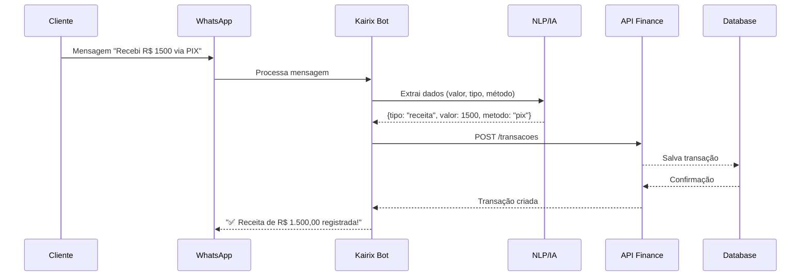

# 💰 Sistema Financeiro - Kairix

## 📋 Índice
1. [Visão Geral](#visão-geral)
2. [Modelos de Dados](#modelos-de-dados)
3. [API Endpoints](#api-endpoints)
4. [Frontend](#frontend)
5. [Funcionalidades](#funcionalidades)
6. [Integração com WhatsApp](#integração-com-whatsapp)
7. [Relatórios e Analytics](#relatórios-e-analytics)
8. [Exemplos de Uso](#exemplos-de-uso)

---

## 🎯 Visão Geral

O Sistema Financeiro do Kairix permite que clientes gerenciem suas finanças de forma completa e automatizada através do WhatsApp e de um dashboard web intuitivo.

### Características Principais

- 📊 **Dashboard em Tempo Real** - Visualização instantânea de receitas, despesas e saldo
- 🏷️ **Categorização** - Organize transações por categorias personalizadas
- 📱 **Integração WhatsApp** - Registre transações via mensagem, áudio ou foto
- 📈 **Relatórios Detalhados** - Análises por categoria, período e tipo
- 🔔 **Alertas Inteligentes** - Notificações de vencimentos e metas
- 💳 **Múltiplos Métodos** - Suporte a PIX, cartão, boleto, transferência, etc.

---

## 🗄️ Modelos de Dados

### TipoTransacao (Enum)

```python
class TipoTransacao(str, enum.Enum):
    RECEITA = "receita"
    DESPESA = "despesa"
```

### MetodoPagamento (Enum)

```python
class MetodoPagamento(str, enum.Enum):
    DINHEIRO = "dinheiro"
    PIX = "pix"
    CARTAO_CREDITO = "cartao_credito"
    CARTAO_DEBITO = "cartao_debito"
    BOLETO = "boleto"
    TRANSFERENCIA = "transferencia"
    OUTRO = "outro"
```

### StatusTransacao (Enum)

```python
class StatusTransacao(str, enum.Enum):
    PENDENTE = "pendente"
    PAGO = "pago"
    RECEBIDO = "recebido"
    CANCELADO = "cancelado"
    ESTORNADO = "estornado"
```

### CategoriaFinanceira

| Campo | Tipo | Descrição |
|-------|------|-----------|
| id | Integer | ID único |
| pedido_id | Integer | Referência ao pedido |
| nome | String(100) | Nome da categoria |
| tipo | TipoTransacao | Receita ou Despesa |
| cor | String(7) | Cor HEX (#FF5733) |
| icone | String(50) | Emoji ou nome do ícone |
| descricao | Text | Descrição da categoria |
| ativo | Boolean | Status ativo/inativo |
| criado_em | DateTime | Data de criação |
| atualizado_em | DateTime | Data de atualização |

**Exemplos de Categorias:**

```python
# Receitas
{
    "nome": "Vendas de Produtos",
    "tipo": "receita",
    "cor": "#00D95F",
    "icone": "💰",
    "ativo": True
}

# Despesas
{
    "nome": "Marketing Digital",
    "tipo": "despesa",
    "cor": "#FF4444",
    "icone": "📢",
    "ativo": True
}
```

### TransacaoFinanceira

| Campo | Tipo | Descrição |
|-------|------|-----------|
| id | Integer | ID único |
| pedido_id | Integer | Referência ao pedido |
| categoria_id | Integer | Referência à categoria (opcional) |
| tipo | TipoTransacao | Receita ou Despesa |
| descricao | String(200) | Descrição da transação |
| valor | Float | Valor da transação |
| data_transacao | DateTime | Data da transação |
| data_vencimento | DateTime | Data de vencimento (opcional) |
| metodo_pagamento | MetodoPagamento | Método de pagamento |
| status | StatusTransacao | Status atual |
| origem | String(50) | Origem (whatsapp, manual, api) |
| origem_mensagem_id | String(200) | ID da mensagem do WhatsApp |
| origem_audio_url | String(500) | URL do áudio transcrito |
| origem_foto_url | String(500) | URL da foto (nota fiscal) |
| observacoes | Text | Observações adicionais |
| tags | String(500) | Tags em JSON |
| anexos | Text | URLs de anexos em JSON |
| recorrente | Boolean | Se é recorrente |
| frequencia_recorrencia | String(50) | Frequência (mensal, semanal) |
| proxima_cobranca | DateTime | Próxima cobrança |
| criado_em | DateTime | Data de criação |
| atualizado_em | DateTime | Data de atualização |

---

## 📡 API Endpoints

### Base URL
```
http://localhost:8012/api/finance
```

### Categorias

#### POST /categorias
Cria nova categoria.

**Request:**
```json
{
  "pedido_id": 1,
  "nome": "Vendas de Produtos",
  "tipo": "receita",
  "cor": "#00D95F",
  "icone": "💰",
  "descricao": "Vendas de produtos físicos e digitais",
  "ativo": true
}
```

**Response:**
```json
{
  "id": 1,
  "pedido_id": 1,
  "nome": "Vendas de Produtos",
  "tipo": "receita",
  "cor": "#00D95F",
  "icone": "💰",
  "descricao": "Vendas de produtos físicos e digitais",
  "ativo": true,
  "criado_em": "2025-10-20T10:00:00",
  "atualizado_em": "2025-10-20T10:00:00"
}
```

#### GET /categorias/{pedido_id}
Lista categorias do pedido.

**Query Parameters:**
- `tipo` (opcional): receita | despesa
- `ativo` (opcional): true | false

**Response:**
```json
[
  {
    "id": 1,
    "nome": "Vendas de Produtos",
    "tipo": "receita",
    "cor": "#00D95F",
    "icone": "💰"
  }
]
```

#### PUT /categorias/{categoria_id}
Atualiza categoria.

#### DELETE /categorias/{categoria_id}
Deleta categoria (apenas se não tiver transações).

---

### Transações

#### POST /transacoes
Cria nova transação.

**Request:**
```json
{
  "pedido_id": 1,
  "categoria_id": 1,
  "tipo": "receita",
  "descricao": "Venda - Cliente João Silva",
  "valor": 1500.00,
  "data_transacao": "2025-10-20T14:30:00",
  "metodo_pagamento": "pix",
  "status": "recebido",
  "observacoes": "Pagamento confirmado via PIX"
}
```

**Response:**
```json
{
  "id": 1,
  "pedido_id": 1,
  "categoria_id": 1,
  "tipo": "receita",
  "descricao": "Venda - Cliente João Silva",
  "valor": 1500.00,
  "data_transacao": "2025-10-20T14:30:00",
  "metodo_pagamento": "pix",
  "status": "recebido",
  "origem": "manual",
  "criado_em": "2025-10-20T14:35:00"
}
```

#### GET /transacoes/{pedido_id}
Lista transações do pedido.

**Query Parameters:**
- `tipo`: receita | despesa
- `status`: pendente | pago | recebido | cancelado | estornado
- `categoria_id`: ID da categoria
- `data_inicio`: YYYY-MM-DDTHH:MM:SS
- `data_fim`: YYYY-MM-DDTHH:MM:SS
- `limite`: Número máximo de resultados (padrão: 100, máx: 1000)
- `offset`: Offset para paginação (padrão: 0)

**Response:**
```json
[
  {
    "id": 1,
    "tipo": "receita",
    "descricao": "Venda - Cliente João Silva",
    "valor": 1500.00,
    "data_transacao": "2025-10-20T14:30:00",
    "status": "recebido",
    "categoria": {
      "id": 1,
      "nome": "Vendas de Produtos",
      "cor": "#00D95F",
      "icone": "💰"
    }
  }
]
```

#### GET /transacoes/detalhes/{transacao_id}
Obtém detalhes de uma transação.

#### PUT /transacoes/{transacao_id}
Atualiza transação.

#### DELETE /transacoes/{transacao_id}
Deleta transação.

---

### Relatórios

#### GET /resumo/{pedido_id}
Obtém resumo financeiro.

**Query Parameters:**
- `data_inicio`: Data início do período (padrão: últimos 30 dias)
- `data_fim`: Data fim do período (padrão: hoje)

**Response:**
```json
{
  "total_receitas": 15000.00,
  "total_despesas": 8500.00,
  "saldo": 6500.00,
  "receitas_pagas": 12000.00,
  "receitas_pendentes": 3000.00,
  "despesas_pagas": 7500.00,
  "despesas_pendentes": 1000.00,
  "total_transacoes": 45,
  "periodo_inicio": "2025-09-20T00:00:00",
  "periodo_fim": "2025-10-20T23:59:59"
}
```

#### GET /transacoes-por-categoria/{pedido_id}
Obtém totais agrupados por categoria.

**Query Parameters:**
- `tipo`: receita | despesa (opcional)
- `data_inicio`: Data início (opcional)
- `data_fim`: Data fim (opcional)

**Response:**
```json
[
  {
    "categoria_id": 1,
    "categoria_nome": "Vendas de Produtos",
    "tipo": "receita",
    "total": 12000.00,
    "quantidade": 25,
    "percentual": 80.0
  },
  {
    "categoria_id": 2,
    "categoria_nome": "Serviços",
    "tipo": "receita",
    "total": 3000.00,
    "quantidade": 5,
    "percentual": 20.0
  }
]
```

#### GET /transacoes-vencendo/{pedido_id}
Obtém transações pendentes com vencimento próximo.

**Query Parameters:**
- `dias`: Número de dias à frente (padrão: 7)

**Response:**
```json
[
  {
    "id": 10,
    "tipo": "despesa",
    "descricao": "Aluguel Escritório",
    "valor": 3500.00,
    "data_vencimento": "2025-10-25T00:00:00",
    "status": "pendente"
  }
]
```

---

## 💻 Frontend

### Acesso
```
http://localhost:8012/financeiro
```

### Estrutura do Dashboard

#### 1. Cards Resumo
- Total Receitas (com pendentes)
- Total Despesas (com pendentes)
- Saldo Atual
- Total de Transações

#### 2. Abas de Navegação
- **Dashboard** - Visão geral e transações recentes
- **Transações** - Gerenciamento completo de transações
- **Categorias** - Gerenciamento de categorias
- **Relatórios** - Análises e gráficos

### Funcionalidades Frontend

#### Gerenciamento de Categorias
- Criar, editar, deletar categorias
- Escolher cor e emoji personalizados
- Ativar/desativar categorias
- Filtrar por tipo (receita/despesa)

#### Gerenciamento de Transações
- Criar, editar, deletar transações
- Filtros avançados:
  - Por tipo (receita/despesa)
  - Por status (pendente, pago, etc.)
  - Por categoria
  - Por período (data início e fim)
- Visualização em tabela
- Badges coloridos para status e tipos

#### Relatórios
- Transações por categoria (gráfico de barras)
- Percentuais por categoria
- Análise temporal
- Exportação de dados (futuro)

---

## 🎯 Funcionalidades

### 1. Gestão de Categorias

#### Criar Categorias Personalizadas
```javascript
// Exemplo via API
POST /api/finance/categorias
{
  "pedido_id": 1,
  "nome": "Marketing Digital",
  "tipo": "despesa",
  "cor": "#FF4444",
  "icone": "📢"
}
```

#### Categorias Padrão Sugeridas

**Receitas:**
- 💰 Vendas de Produtos
- 🛍️ Vendas de Serviços
- 💳 Pagamentos Recorrentes
- 🎁 Comissões
- 💵 Investimentos

**Despesas:**
- 📢 Marketing e Publicidade
- 🏢 Aluguel e Condomínio
- ⚡ Contas de Consumo
- 👥 Salários e Encargos
- 🚗 Transporte e Logística
- 💻 Tecnologia e Software
- 🎓 Treinamento e Capacitação

### 2. Registro de Transações

#### Manual (Dashboard)
1. Acessar aba "Transações"
2. Clicar em "➕ Nova Transação"
3. Preencher formulário
4. Salvar

#### Via WhatsApp (Futuro)

**Texto:**
```
Recebi R$ 1500 da venda para João Silva via PIX
```

**Áudio:**
```
"Paguei mil e quinhentos reais de aluguel hoje"
```

**Foto:**
Enviar foto da nota fiscal → OCR extrai dados automaticamente

### 3. Filtros e Buscas

#### Filtros Disponíveis
- **Tipo:** Receitas | Despesas | Todos
- **Status:** Pendente | Pago | Recebido | Cancelado | Todos
- **Categoria:** Todas as categorias | Categoria específica
- **Período:** Data início e data fim personalizados

#### Exemplo de Query
```javascript
// Buscar despesas pendentes de marketing em outubro
GET /api/finance/transacoes/1?tipo=despesa&status=pendente&categoria_id=5&data_inicio=2025-10-01T00:00:00&data_fim=2025-10-31T23:59:59
```

### 4. Recorrência

#### Transações Recorrentes
```json
{
  "descricao": "Aluguel Escritório",
  "valor": 3500.00,
  "recorrente": true,
  "frequencia_recorrencia": "mensal",
  "proxima_cobranca": "2025-11-05T00:00:00"
}
```

O sistema automaticamente:
- Cria nova transação na data da próxima cobrança
- Atualiza a data da próxima cobrança
- Mantém histórico completo

---

## 📱 Integração com WhatsApp

### Fluxo de Integração



### Comandos WhatsApp (Futuro)

#### Registrar Transação
```
/receita 1500 PIX Venda cliente João
/despesa 350 Cartão Almoço equipe
```

#### Consultar Saldo
```
/saldo
/saldo este mes
/saldo outubro
```

#### Ver Resumo
```
/resumo
/resumo mensal
/resumo categorias
```

#### Listar Transações
```
/transacoes
/transacoes receitas
/transacoes pendentes
```

### Processamento de Áudio

```python
# Fluxo simplificado
def processar_audio_whatsapp(audio_url, pedido_id):
    # 1. Download do áudio
    audio = download_audio(audio_url)

    # 2. Transcrição (Whisper API)
    texto = transcribe_audio(audio)
    # "Paguei mil e quinhentos reais de aluguel hoje"

    # 3. NLP para extrair dados
    dados = extract_financial_data(texto)
    # {tipo: "despesa", valor: 1500, descricao: "aluguel", data: "hoje"}

    # 4. Criar transação
    transacao = criar_transacao(pedido_id, dados)

    # 5. Retornar confirmação
    return f"✅ Despesa de R$ {transacao.valor} registrada!"
```

### Processamento de Foto (OCR)

```python
def processar_nota_fiscal(foto_url, pedido_id):
    # 1. Download da imagem
    imagem = download_image(foto_url)

    # 2. OCR (Tesseract / Google Vision API)
    texto = ocr_extract(imagem)

    # 3. Parsing de nota fiscal
    dados = parse_nota_fiscal(texto)
    # {
    #   empresa: "Fornecedor LTDA",
    #   valor: 350.00,
    #   data: "2025-10-20",
    #   items: [...]
    # }

    # 4. Criar transação
    transacao = criar_transacao(pedido_id, {
        "tipo": "despesa",
        "valor": dados.valor,
        "descricao": f"NF {dados.numero} - {dados.empresa}",
        "origem_foto_url": foto_url
    })

    return transacao
```

---

## 📈 Relatórios e Analytics

### 1. Resumo Financeiro

#### Dados Exibidos
- Total de receitas (período)
- Total de despesas (período)
- Saldo (receitas - despesas)
- Receitas pagas vs pendentes
- Despesas pagas vs pendentes
- Total de transações

#### Período Configurável
- Últimos 7 dias
- Últimos 30 dias (padrão)
- Este mês
- Mês anterior
- Período personalizado

### 2. Transações por Categoria

#### Visualização
- Gráfico de barras horizontal
- Percentual de cada categoria no total
- Quantidade de transações por categoria
- Total em valor por categoria

#### Filtros
- Por tipo (receitas ou despesas)
- Por período

### 3. Alertas e Notificações (Futuro)

#### Vencimentos Próximos
```
🔔 Você tem 3 transações vencendo nos próximos 7 dias:
   - Aluguel: R$ 3.500,00 (vence em 5 dias)
   - Fornecedor X: R$ 1.200,00 (vence em 3 dias)
   - Software XYZ: R$ 299,00 (vence amanhã)
```

#### Metas Atingidas
```
🎉 Parabéns! Você atingiu 80% da meta de receitas do mês!
   Meta: R$ 50.000,00
   Atual: R$ 40.000,00
```

#### Alertas de Despesas
```
⚠️ Atenção! Categoria "Marketing" está 120% acima da média mensal.
   Média: R$ 2.000,00
   Este mês: R$ 4.400,00
```

---

## 📝 Exemplos de Uso

### Exemplo 1: Registrar Venda

```bash
# 1. Criar categoria (se não existir)
curl -X POST http://localhost:8012/api/finance/categorias \
  -H "Content-Type: application/json" \
  -d '{
    "pedido_id": 1,
    "nome": "Vendas de Produtos",
    "tipo": "receita",
    "cor": "#00D95F",
    "icone": "💰"
  }'

# Response: { "id": 1, ... }

# 2. Registrar transação
curl -X POST http://localhost:8012/api/finance/transacoes \
  -H "Content-Type: application/json" \
  -d '{
    "pedido_id": 1,
    "categoria_id": 1,
    "tipo": "receita",
    "descricao": "Venda - Cliente João Silva",
    "valor": 1500.00,
    "data_transacao": "2025-10-20T14:30:00",
    "metodo_pagamento": "pix",
    "status": "recebido"
  }'
```

### Exemplo 2: Registrar Despesa Recorrente

```bash
curl -X POST http://localhost:8012/api/finance/transacoes \
  -H "Content-Type: application/json" \
  -d '{
    "pedido_id": 1,
    "categoria_id": 5,
    "tipo": "despesa",
    "descricao": "Aluguel Escritório",
    "valor": 3500.00,
    "data_transacao": "2025-10-05T00:00:00",
    "data_vencimento": "2025-10-05T00:00:00",
    "metodo_pagamento": "transferencia",
    "status": "pago",
    "recorrente": true,
    "frequencia_recorrencia": "mensal",
    "proxima_cobranca": "2025-11-05T00:00:00"
  }'
```

### Exemplo 3: Consultar Resumo Mensal

```bash
# Resumo de outubro/2025
curl "http://localhost:8012/api/finance/resumo/1?data_inicio=2025-10-01T00:00:00&data_fim=2025-10-31T23:59:59"

# Response:
{
  "total_receitas": 45000.00,
  "total_despesas": 28500.00,
  "saldo": 16500.00,
  "receitas_pagas": 40000.00,
  "receitas_pendentes": 5000.00,
  "despesas_pagas": 25000.00,
  "despesas_pendentes": 3500.00,
  "total_transacoes": 87
}
```

### Exemplo 4: Ver Transações por Categoria

```bash
curl "http://localhost:8012/api/finance/transacoes-por-categoria/1?tipo=despesa&data_inicio=2025-10-01T00:00:00&data_fim=2025-10-31T23:59:59"

# Response:
[
  {
    "categoria_id": 5,
    "categoria_nome": "Aluguel e Condomínio",
    "tipo": "despesa",
    "total": 3500.00,
    "quantidade": 1,
    "percentual": 12.3
  },
  {
    "categoria_id": 6,
    "categoria_nome": "Marketing Digital",
    "tipo": "despesa",
    "total": 4500.00,
    "quantidade": 8,
    "percentual": 15.8
  }
]
```

---

## 🔒 Segurança

### Validações Implementadas

1. **Categoria x Transação:**
   - Tipo da categoria deve corresponder ao tipo da transação
   - Categoria deve pertencer ao mesmo pedido da transação

2. **Valores:**
   - Valores devem ser maiores que zero
   - Validação de campos obrigatórios

3. **Datas:**
   - Data de transação é obrigatória
   - Data de vencimento é opcional

4. **Exclusão:**
   - Categorias só podem ser excluídas se não tiverem transações associadas

---

## 🚀 Próximas Funcionalidades

### Em Desenvolvimento
- [ ] Integração completa com WhatsApp
- [ ] Processamento de áudio via Whisper
- [ ] OCR para notas fiscais
- [ ] Recorrência automática
- [ ] Notificações de vencimento

### Planejadas
- [ ] Exportação para Excel/PDF
- [ ] Gráficos avançados (linha, pizza)
- [ ] Conciliação bancária
- [ ] Previsão de fluxo de caixa
- [ ] Metas financeiras
- [ ] Multi-moeda
- [ ] Integração com contabilidade

---

## 📞 Suporte

- **Email**: suporte@kairix.com.br
- **Documentação API**: http://localhost:8012/docs
- **WhatsApp**: (65) 99999-9999

---

## 📄 Changelog

### v1.0.0 (2025-10-20)
- Sistema financeiro completo implementado
- CRUD de categorias e transações
- Dashboard interativo
- Relatórios por categoria
- API REST completa
- Frontend responsivo

---

Copyright © 2025 Kairix - Todos os direitos reservados
